# mec-portal 設計書（Ver.2）

## 1. コンセプト

### システム概要
**mec-portal** は、日本メカトロン社内の情報・申請・資料を一元管理するポータルサイトです。  
「探す・申請する・共有する」をひとつの画面で完結させ、  
業務効率化と承認フローの透明化を目的とします。

### 想定利用者
- 一般社員（情報閲覧・申請）
- 部署責任者（出張・経費の承認）
- 業務部（経費・出張の承認）
- 管理者（システム運用・お知らせ投稿・マスタ管理）

### コア技術
| 項目 | 技術 |
|------|------|
| Framework | Laravel 12 + Blade |
| UI | Tailwind CSS + Alpine.js |
| DB | MySQL |
| Container | Laravel Sail (Docker) |
| Excel生成 | PhpOffice/PhpSpreadsheet |
| AI支援 | OpenAI API（将来実装予定：文面要約・費目自動分類） |

---

## 2. 機能一覧

| 区分 | 機能名 | 概要 | 実装状況 |
|------|---------|------|----------|
| 📊 共通 | ダッシュボード | お知らせ・申請状況・リンクを一覧表示 | ✅ 実装済み（ロール別表示、FAQ検索フォーム、管理者はマスタ管理カード） |
| 📰 情報共有 | お知らせ | 管理者が投稿／社員は閲覧 | ✅ 実装済み |
| 📁 情報共有 | ドキュメント | 各種資料（PDF/Excel等）の共有・検索・部署別分類 | ✅ 実装済み |
| ❓ ナレッジ | FAQ | よくある質問をカテゴリ別に検索表示 | ✅ 実装済み（管理者編集可能） |
| 📞 コミュニケーション | 問い合わせフォーム | 部署宛ての質問・要望送信 | ✅ 実装済み（部署責任者へのメール通知、スレッド機能） |
| 🏢 業務支援 | 会議室予約 | 会議室の予約・キャンセル・一覧 | ⏸️ 保留中（他システム利用のため） |
| 💴 経費精算 | 経費申請フォーム | 通常経費・交通費（月次一括申請対応） | ✅ 実装済み（Excel生成、承認フロー、差し戻し後の再申請可能） |
| 🚄 出張申請 | 出張・交通費精算 | 部署承認→業務部承認 | ✅ 実装済み（Excel生成、承認フロー、差し戻し後の再申請可能） |
| 🔐 管理 | 承認フロー | 各申請のステータス・履歴管理 | ✅ 実装済み（多段階承認対応、承認待ち一覧） |
| 👥 管理 | マスタ管理 | ユーザー管理・部署管理（管理者のみ） | ✅ 実装済み |
| 👤 共通 | プロフィール編集 | ユーザー情報・パスワード変更 | ✅ 実装済み（Breeze標準機能） |
| 👤 共通 | 社員紹介 | 部署別社員一覧 | ✅ 実装済み |
| 🏢 共通 | 会社の色々 | 会社情報・連絡先・各種リンク | ✅ 実装済み |

---

## 3. 画面構成

```
ダッシュボード
 ├─ FAQ検索フォーム（クリックでFAQ一覧へ）
 ├─ お知らせ一覧（最新5件）
 ├─ ドキュメント（最近追加された資料5件）
 ├─ 機能カード
 │   ├─ 社内連絡（お知らせ）
 │   ├─ 会社の色々
 │   ├─ 各種資料
 │   ├─ ご意見箱
 │   ├─ 経費精算
 │   └─ FAQ / マスタ管理（管理者のみマスタ管理カード表示）

お知らせ
 ├─ 一覧（カテゴリ・優先度フィルタ）
 ├─ 詳細表示
 ├─ 投稿（管理者のみ）
 └─ 編集・削除（管理者のみ）

ドキュメント
 ├─ 一覧（部署・カテゴリ・ファイルタイプでフィルタ）
 ├─ 詳細（プレビュー・ダウンロード）
 └─ アップロード（管理者のみ）

経費精算
 ├─ メニュー画面（経費・交通費・出張）
 ├─ 通常経費：入力フォーム
 ├─ 交通費：月次一括申請（親子構造）
 ├─ 一覧・詳細表示
 ├─ Excelダウンロード
 └─ 差し戻し後の再申請可能

出張申請
 ├─ 入力フォーム（複数の経費明細対応）
 ├─ 一覧・詳細表示
 ├─ Excelダウンロード
 └─ 差し戻し後の再申請可能

承認待ち一覧
 ├─ 承認者向け一覧
 ├─ Excelダウンロード
 ├─ 承認・差戻機能
 └─ 承認履歴表示

問い合わせ（ご意見箱）
 ├─ フォーム送信（部署選択）
 └─ 部署責任者へのメール通知

FAQ
 ├─ カテゴリ一覧・検索
 ├─ 詳細表示
 └─ 「役に立った」機能

マスタ管理（管理者のみ）
 ├─ ユーザー管理（CRUD、検索・フィルタ）
 ├─ 部署管理（階層構造、責任者設定）
 ├─ お知らせ管理（リンク）
 ├─ 資料管理（リンク）
 └─ FAQ管理（リンク）

社員紹介
 └─ 部署別一覧表示

会社の色々
 ├─ 社員情報（リンク）
 ├─ 連絡先情報
 └─ 各種リンク
```

---

## 4. データモデル（ER 図）

```mermaid
erDiagram

    USERS ||--o{ USER_DIVISIONS : belongs
    DIVISIONS ||--o{ USER_DIVISIONS : includes
    DIVISIONS ||--o| USERS : managed_by
    USERS ||--o{ DIVISIONS : belongs_to

    USERS ||--o{ EXPENSES : submits
    EXPENSES ||--o{ EXPENSES : parent_child
    USERS ||--o{ TRAVEL_REQUESTS : submits
    TRAVEL_REQUESTS ||--o{ TRAVEL_EXPENSES : includes
    USERS ||--o{ RESERVATIONS : books
    USERS ||--o{ INQUIRIES : sends
    USERS ||--o{ WORKFLOW_APPROVALS : approves
    USERS ||--o{ NEWS : posts
    USERS ||--o{ DOCUMENTS : uploads

    EXPENSES ||--o{ WORKFLOW_APPROVALS : approval_flow
    TRAVEL_REQUESTS ||--o{ WORKFLOW_APPROVALS : approval_flow
    DIVISIONS ||--o{ DOCUMENTS : has

    USERS {
        int id PK
        string user_code "ユニーク"
        string name
        string email "ユニーク"
        string password
        tinyint role "0:user, 1:admin, 2:manager"
        int division_id FK "nullable"
        tinyint delete_flg "0:有効, 1:削除"
        datetime email_verified_at
        datetime created_at
        datetime updated_at
    }

    DIVISIONS {
        int id PK
        string name
        int manager_id FK "nullable"
        int parent_id FK "nullable"
        datetime created_at
        datetime updated_at
    }

    USER_DIVISIONS {
        int id PK
        int user_id FK
        int division_id FK
        tinyint main_flag "1=主所属,0=兼任"
        datetime created_at
        datetime updated_at
    }

    EXPENSES {
        int id PK
        int user_id FK
        int parent_id FK "nullable（交通費の親子構造）"
        date date "経費発生日"
        date period_from "nullable（交通費申請期間開始）"
        date period_to "nullable（交通費申請期間終了）"
        string category "費目"
        boolean is_transportation "交通費申請フラグ"
        decimal amount
        string description
        string vehicle "nullable（乗物）"
        string route_from "nullable（出発地）"
        string route_via "nullable（経由地）"
        string route_to "nullable（到着地）"
        enum transportation_type "nullable（片道/往復）"
        string receipt_path "nullable（領収書パス）"
        string excel_path "nullable（Excelパス）"
        tinyint status "0=申請中,1=承認済,2=差戻"
        datetime created_at
        datetime updated_at
    }

    TRAVEL_REQUESTS {
        int id PK
        int user_id FK
        string destination "出張先"
        string purpose "目的"
        date departure_date "出発日"
        date return_date "帰着日"
        decimal subtotal "小計"
        decimal advance_payment "仮払金"
        decimal settlement_amount "精算金額"
        tinyint settlement_type "0=返金,1=支給"
        tinyint status "0=申請中,1=承認済,2=差戻"
        datetime approved_at "nullable"
        string excel_path "nullable（Excelパス）"
        datetime created_at
        datetime updated_at
    }

    TRAVEL_EXPENSES {
        int id PK
        int travel_request_id FK
        date date
        string description "内容"
        enum category "交通費,宿泊費,日当,半日当,その他"
        decimal cash "現金"
        decimal ticket "チケット"
        decimal total "合計"
        text remarks "nullable（備考）"
        datetime created_at
        datetime updated_at
    }

    RESERVATIONS {
        int id PK
        int user_id FK
        string room_name "会議室名"
        datetime start_time "開始日時"
        datetime end_time "終了日時"
        string description "nullable（利用目的）"
        tinyint status "0=予約中,1=完了,2=キャンセル"
        datetime created_at
        datetime updated_at
    }

    INQUIRIES {
        int id PK
        int user_id FK "送信者ID"
        string subject "件名"
        text message "メッセージ"
        string department "送信先部署"
        int parent_id FK "nullable（親問い合わせID）"
        int thread_id "nullable（スレッドID）"
        int replied_by FK "nullable（返信者ID）"
        datetime replied_at "nullable"
        tinyint status "0=未対応,1=対応中,2=対応済"
        datetime created_at
        datetime updated_at
    }

    NEWS {
        int id PK
        string title "タイトル"
        text content "本文"
        string category "nullable（カテゴリ）"
        tinyint priority "0:通常, 1:重要"
        int posted_by FK "投稿者ID"
        datetime published_at "nullable（公開日時）"
        int view_count "閲覧数"
        datetime created_at
        datetime updated_at
    }

    DOCUMENTS {
        int id PK
        string title "資料タイトル"
        string file_path "S3パスまたはローカルパス"
        string file_type "拡張子（PDF, XLSX, DOCXなど）"
        string category "nullable（分類）"
        int division_id FK "nullable（部署ID、nullの場合は全般）"
        int uploaded_by FK "アップロード者ID"
        int view_count "閲覧回数"
        datetime created_at
        datetime updated_at
    }

    FAQ {
        int id PK
        text question "質問"
        text answer "回答"
        string category "nullable（分類）"
        int helpful_count "「役に立った」数"
        int view_count "閲覧数"
        json embedding_vector "nullable（AI検索用ベクトル）"
        datetime created_at
        datetime updated_at
    }

    WORKFLOW_APPROVALS {
        int id PK
        string request_type "申請種別（travel, expense等）"
        int request_id "対象申請ID"
        int applicant_id FK "申請者ID"
        int approval_order "承認順序（例：1=部署長, 2=経理）"
        int approver_id FK "nullable（承認者ID）"
        tinyint is_final_approval "1=最終承認"
        tinyint status "0=未処理, 1=承認, 2=差戻"
        text comment "nullable（コメント）"
        datetime approved_at "nullable（承認日時）"
        datetime created_at
        datetime updated_at
    }
```



---

## 5. 承認フロー概要

### 通常経費申請
```
社員（申請）
   ↓
業務部（承認・最終承認）
```

### 交通費申請（月次一括）
```
社員（月次一括申請）
   ↓
業務部（承認・最終承認）
```

### 出張申請
```
社員（出張申請）
   ↓
部署責任者（1段階目承認）
   ↓
業務部（2段階目・最終承認）
```

### 承認フロー詳細
- **多段階承認対応**: `approval_order`で承認順序を管理
- **最終承認フラグ**: `is_final_approval`で最終承認を判定
- **承認履歴**: すべての承認ステップを`workflow_approvals`で記録
- **差し戻し対応**: 差し戻し後は申請者本人のみ再申請可能
- **改ざん防止**: 申請後の編集は申請者本人のみ（申請中・差戻状態のみ）、業務部・部署責任者も編集不可

---

## 6. Excel生成・メール送信設計

| 機能 | 送信先 | 出力形式 | ファイル名 | 実装状況 |
|------|--------|----------|------------|----------|
| 経費申請 | 業務部全員 | 通知メールのみ | - | ✅ 実装済み |
| 交通費申請 | 業務部全員 | 通知メールのみ | - | ✅ 実装済み |
| 出張申請 | 業務部全員 | 通知メールのみ | - | ✅ 実装済み |
| 問い合わせ | 部署責任者 | メール本文 | - | ✅ 実装済み |

### Excelファイル管理
- **生成タイミング**: 申請時に自動生成し、`excel_path`に保存
- **ダウンロード場所**: 承認待ち一覧、申請詳細画面からダウンロード可能
- **ファイル名規則**:
  - 通常経費: `経費申請書_{社員コード}_{日付}.xlsx`
  - 交通費: `交通費請求明細書_{社員コード}_{期間開始日}.xlsx`
  - 出張: `出張申請書_{社員コード}_{出発日}.xlsx`
- **再生成**: ファイルが存在しない場合は自動再生成

### メール送信方針（パターン2）
- **申請時**: 通知メールのみ送信（Excelは添付しない）
- **メール内容**: 申請内容の概要と、ポータルサイトからExcelをダウンロードできる旨を記載
- **Excel取得**: 承認待ち一覧または申請詳細画面からダウンロード

### 実装技術
- Excel生成には `PhpOffice/PhpSpreadsheet` を使用
- 交通費申請は「交通費請求明細書」形式に対応

---

## 7. セキュリティ・運用方針

### ユーザー管理
- **新規登録**: 一般ユーザーからの新規登録は無効化（不正アクセス防止）
- **ユーザー登録**: 管理者のみがマスタ管理画面から登録可能
- **ロール管理**: 
  - `0`: 一般ユーザー
  - `1`: 管理者（全機能アクセス可能、マスタ管理可能）
  - `2`: 部署責任者（承認機能、一部管理機能）

### 申請データ保護
- **改ざん防止**: 
  - 申請後の編集は申請者本人のみ可能（申請中・差戻状態のみ）
  - 業務部・部署責任者・管理者も申請後の編集は不可
  - 承認済みデータは編集不可
- **差し戻し対応**: 差し戻し後は申請者本人のみ再申請可能

---

## 8. AI支援設計（将来実装予定）

| 対象 | AI活用例 | モデル | 実装状況 |
|------|-----------|--------|----------|
| お知らせ文 | 文体整形・要約・敬語調整 | GPT-4o-mini | ⏸️ 未実装 |
| 経費精算 | 内容から費目を自動分類 | GPT-4-turbo | ⏸️ 未実装 |
| FAQ | 質問文→既存回答検索 | Embedding | ⏸️ 未実装（DB構造は準備済み） |
| 出張目的 | 文面から自動要約して承認時表示 | GPT-4o-mini | ⏸️ 未実装 |

---

## 9. 開発ロードマップ

| フェーズ | 内容 | 期間 | 状態 |
|----------|------|------|------|
| ① 設計 | ER図・画面構成・要件整理 | 2025/11/10 | ✅ 完了 |
| ② 自動生成 | AIでMigration／Model／Controller生成 | 2025/11/20 | ✅ 完了 |
| ③ UI構築 | Bladeテンプレート＋Tailwindレイアウト | 2025/12/01 | ✅ 完了 |
| ④ 機能拡張 | 経費／出張／承認ワークフロー | 2025/12 | ✅ 完了 |
| ⑤ 会議室予約 | 会議室予約機能 | - | ⏸️ 保留（他システム利用中） |
| ⑥ AI連携 | GPT要約／費目分類／自動承認支援 | - | ⏸️ 将来実装 |

---

## 10. ディレクトリ構成（実装済み）

```
app/
 ├─ Models/
 │   ├─ User.php
 │   ├─ Division.php
 │   ├─ Expense.php
 │   ├─ TravelRequest.php
 │   ├─ TravelExpense.php
 │   ├─ Inquiry.php
 │   ├─ WorkflowApproval.php
 │   ├─ News.php
 │   ├─ Document.php
 │   └─ FAQ.php
 ├─ Http/Controllers/
 │   ├─ DashboardController.php
 │   ├─ NewsController.php
 │   ├─ DocumentController.php
 │   ├─ FAQController.php
 │   ├─ InquiryController.php
 │   ├─ ExpenseController.php
 │   ├─ ExpenseMenuController.php
 │   ├─ TravelRequestController.php
 │   ├─ ApprovalController.php
 │   ├─ UserController.php
 │   ├─ CompanyInfoController.php
 │   └─ Admin/
 │       ├─ MasterController.php
 │       ├─ UserManagementController.php
 │       └─ DivisionManagementController.php
 ├─ Policies/
 │   ├─ NewsPolicy.php
 │   ├─ DocumentPolicy.php
 │   ├─ FAQPolicy.php
 │   ├─ InquiryPolicy.php
 │   ├─ ExpensePolicy.php
 │   └─ TravelRequestPolicy.php
 ├─ Mail/
 │   ├─ ExpenseNotification.php
 │   ├─ TravelNotification.php
 │   ├─ InquiryNotification.php
 │   ├─ ApprovalNotification.php
 │   └─ RejectionNotification.php
resources/
 ├─ views/
 │   ├─ layouts/
 │   │   ├─ app.blade.php
 │   │   └─ navigation.blade.php
 │   ├─ dashboard.blade.php
 │   ├─ news/
 │   ├─ documents/
 │   ├─ faqs/
 │   ├─ inquiries/
 │   ├─ expenses/
 │   ├─ travel-requests/
 │   ├─ approvals/
 │   ├─ users/
 │   ├─ company-info/
 │   ├─ admin/
 │   │   ├─ masters/
 │   │   ├─ users/
 │   │   └─ divisions/
 │   ├─ profile/
 │   └─ emails/
database/
 ├─ migrations/
 │   ├─ 0001_01_01_000000_create_users_table.php
 │   ├─ 2025_11_10_000001_create_divisions_table.php
 │   ├─ 2025_11_10_000002_create_user_divisions_table.php
 │   ├─ 2025_11_10_000003_create_expenses_table.php
 │   ├─ 2025_11_10_000004_create_travel_requests_table.php
 │   ├─ 2025_11_10_000005_create_travel_expenses_table.php
 │   ├─ 2025_11_10_000006_create_reservations_table.php
 │   ├─ 2025_11_10_000007_create_inquiries_table.php
 │   ├─ 2025_11_10_000008_create_workflow_approvals_table.php
 │   ├─ 2025_11_10_000009_create_news_table.php
 │   ├─ 2025_11_10_000010_create_documents_table.php
 │   ├─ 2025_11_10_000011_create_faqs_table.php
 │   ├─ 2025_11_01_112748_add_division_id_to_users_table.php
 │   ├─ 2025_11_10_000012_modify_expenses_table_for_transportation.php
 │   └─ 2025_11_10_000013_add_excel_path_to_expenses_and_travel_requests.php
 └─ seeders/
     ├─ DatabaseSeeder.php
     ├─ DivisionSeeder.php
     └─ UserSeeder.php
```

---

## 11. 今後の発展構想（Ver.3以降）

- ⏸️ SSO（社内AD連携）
- ⏸️ Teams／Slack承認通知
- ⏸️ 申請Excel自動保存（SharePoint or Drive連携）
- ⏸️ 出張申請と経費申請の自動紐付け
- ⏸️ ダッシュボードAI分析（承認率・利用率の可視化）
- ⏸️ 会議室予約機能（他システム移行後に実装）

---

## 12. 実装済み機能の詳細

### 認証・プロフィール
- ✅ Laravel Breeze標準の認証機能
- ✅ ログイン・ログアウト
- ✅ パスワードリセット
- ✅ プロフィール編集（日本語対応）
- ✅ 新規登録は無効化（管理者のみユーザー登録可能）

### ダッシュボード
- ✅ お知らせ最新5件表示
- ✅ 最近アップロードされた資料5件表示
- ✅ FAQ検索フォーム（クリックでFAQ一覧へ）
- ✅ 機能カード（ロール別表示）
  - 管理者: マスタ管理カード表示
  - 一般ユーザー: FAQカード表示
- ✅ 外部リンク（Gmail、Drive、Meet、Calendar、Chatwork、Zoom、AKASHI、SS-PAYCIAL、X）

### 経費精算
- ✅ 通常経費申請
- ✅ 交通費申請（月次一括、親子構造）
- ✅ Excel生成（申請時）
- ✅ 承認フロー（業務部）
- ✅ 差し戻し後の再申請
- ✅ Excelダウンロード機能
- ✅ 改ざん防止（申請後の編集は申請者本人のみ）

### 出張申請
- ✅ 出張申請フォーム（複数経費明細対応）
- ✅ Excel生成（申請時）
- ✅ 多段階承認フロー（部署責任者 → 業務部）
- ✅ 差し戻し後の再申請
- ✅ Excelダウンロード機能

### 承認機能
- ✅ 承認待ち一覧（承認者向け）
- ✅ 承認・差戻機能
- ✅ 承認履歴表示
- ✅ Excelダウンロード機能
- ✅ メール通知（承認・差戻時）

### マスタ管理（管理者のみ）
- ✅ ユーザー管理（CRUD、検索・フィルタ）
- ✅ 部署管理（階層構造、責任者設定）
- ✅ お知らせ管理（リンク）
- ✅ 資料管理（リンク）
- ✅ FAQ管理（リンク）

---

© 2025 Nihon Mechatron Co., Ltd.
